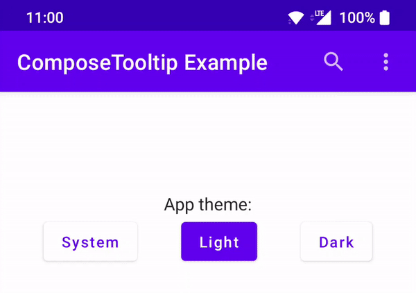

# Compose Tooltip

[](https://mvnrepository.com/artifact/dev.patrickgold.compose.tooltip/tooltip) 

A small library which adds support for tooltips in Jetpack Compose on Android:



The 2 main goals of this library are:
- (a) have the ability to put a tooltip on any element via a simple modifier, not with an additional layout
- (b) the look and behavior of the tooltip should by default match the Android framework tooltip as close as possible

## Usage

### Dependency management

```kotlin
// settings.gradle.kts
repositories {
    mavenCentral()
}

// build.gradle.kts
dependencies {
    implementation("dev.patrickgold.compose.tooltip:tooltip:<version>")
}
```

### Basic example

The tooltip is applied as a modifier, for the default look only a text is passed:

```kotlin
IconButton(
    onClick = { /* Do something */ },
    modifier = Modifier.tooltip("Search examples"),
) {
    Icon(Icons.Outlined.Search, "Search")
}
```

You can put a `tooltip()` modifier on basically any element you desire, however in practice you should follow the [Material guidelines](https://material.io/components/tooltips) on where to put a tooltip and where not.

While the tooltip by default tries to mimic the Android framework tooltip as closely as possible, you can style the tooltip as you wish by passing further parameters. Please see the Documentation section for more info.

### Compose UI version compatibility

The following table outlines which Tooltip version matches which Compose version. You can use a different version of Compose UI and it may still work, however there are no guarantees.

Tooltip | Compose UI | Kotlin
---|---|---
0.1.x | 1.2.x | 1.7.10

## Documentation

Material design tooltip following Android's framework tooltip design as close as possible by default.

The tooltip anchors itself automatically to the element this modifier is applied and does automatic positioning and sizing in a similar way to the Android framework tooltip.

Both long-press touch interactions and mouse hover events are supported. For long-press touches, the tooltip starts to show after the user has triggered a long-click and will then stay until 1.5 seconds after the touch up or cancel event. For mouse hover interactions, the tooltip is shown after a minimum of 0.5 seconds hover, and then shows until either the mouse stops hovering or 15 seconds have passed, whichever comes first.

This modifier by default can only be used within an Activity or InputMethodService context, as it requires a window to properly show. Alternatively a custom windowResolver can be passed, where the responsibility is up to the caller to find the window reference.

**_Parameters:_**

 - `text` The text to show in the tooltip, supports AnnotatedString.
 - `backgroundColor` The background color of this tooltip. Defaults to #e6FFFFFF for dark and #e6616161 for light Material themes.
 - `textColor` The text color of this tooltip. Defaults to Color.Black for dark and Color.White for light Material themes.
 - `textStyle` The text style to be applied to the text. Defaults to 14sp sans-serif font.
 - `overflow` How overflow of the text should be handed. Defaults to TextOverflow.Ellipsis.
 - `maxLines` How many lines the tooltip can have at most. Defaults to 3.
 - `margin` The margin of this tooltip. Defaults to 8dp on all edges.
 - `padding` The padding of the tooltip. Defaults to 16dp horizontally and 6.5dp vertically.
 - `shape` The shape of the tooltip. Defaults to a rounded corner shape with 2dp corner radius on all corners.
 - `windowResolver` The window resolver, which is responsible for retrieving the local window. The default implementation supports both Activity and InputMethodService contexts. If a custom provider is passed, it must not return null.

**_Method signature:_**

```kotlin
fun Modifier.tooltip(
    text: CharSequence,
    backgroundColor: Color = Color.Unspecified,
    textColor: Color = Color.Unspecified,
    textStyle: TextStyle = TooltipTextStyle,
    overflow: TextOverflow = TextOverflow.Ellipsis,
    maxLines: Int = 3,
    margin: PaddingValues = TooltipMargin,
    padding: PaddingValues = TooltipPadding,
    shape: Shape = TooltipShape,
    windowResolver: @Composable () -> Window = { LocalContext.current.findWindow()!! },
): Modifier
```

## Known issues

- For elements that are taller than the window height the positioning logic fails and causes the tooltip to be placed on the bottom edge of the window
- The tooltip currently does not provide accessibility semantics, may need to investigate if needed

## License

```
Copyright 2022 Patrick Goldinger

Licensed under the Apache License, Version 2.0 (the "License");
you may not use this file except in compliance with the License.
You may obtain a copy of the License at

http://www.apache.org/licenses/LICENSE-2.0

Unless required by applicable law or agreed to in writing, software
distributed under the License is distributed on an "AS IS" BASIS,
WITHOUT WARRANTIES OR CONDITIONS OF ANY KIND, either express or implied.
See the License for the specific language governing permissions and
limitations under the License.
```
